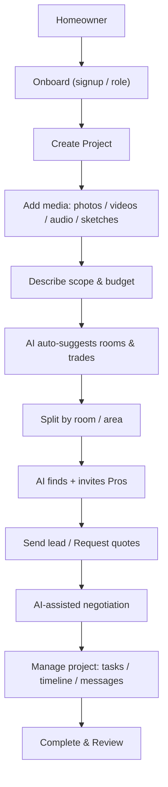

# Buildr — Product Narrative, Personas, AI Strategy & Technical Notes

This document defines **Buildr’s mission, personas, value propositions, AI strategy, and technical foundations**.  
It serves as a shared source of truth for product, design, and engineering, guiding how we prioritize and build.

---

## Mission

**Buildr helps homeowners capture renovation projects through rich media, get accurate quotes from vetted professionals, and manage projects end-to-end with confidence.**

Our differentiator: **AI-powered matching, negotiation support, and streamlined project workflows** — solving the two hardest problems in this space:

1. **Scarce professionals**: pros are busy, skeptical, and don’t proactively chase leads.
2. **Friction-heavy quoting & negotiation**: projects stall due to unclear scope, missing data, and slow back-and-forth.

---

## Personas & Needs

### 1. Homeowner

- **Goals**:
  - Capture renovation intent quickly
  - Receive accurate, comparable quotes
  - Manage project progress, payments, and communication
- **Needs**:
  - Media-first project composer (photos, video, voice notes)
  - Guided room/area definition
  - Transparency in pricing and timelines
  - Easy project sharing with partners/family
  - **AI guidance** on realistic budgets, trade-offs, and next steps

### 2. Professional (Pro)

- **Goals**:
  - Access qualified leads without wasting time
  - Showcase past work and credibility
  - Win jobs efficiently
  - Manage projects and billing smoothly
- **Needs**:
  - Rich portfolio with social proof
  - Accurate project data (photos, measurements, floor plans)
  - Streamlined proposal workflows
  - Scheduling, messaging, and invoicing tools
  - **AI-optimized lead matching**: only high-quality, relevant projects
  - **AI-assist for proposal drafting & negotiation**

---

## Value Propositions

- **Media-first capture**: homeowners upload photos, videos, voice notes, or floor plans → Buildr structures this into rooms/trades with templates.
- **AI-matched leads**: Buildr’s matching engine finds the right professionals (even scarce ones), proactively reaches out, and nudges them to respond.
- **Streamlined quoting**: AI auto-completes missing scope details, suggests price ranges, and creates draft proposals pros can quickly confirm.
- **Negotiation support**: conversational AI bridges homeowner–pro gaps by clarifying requirements, highlighting trade-offs, and mediating misunderstandings.
- **Project hub**: single source of truth for tasks, timelines, deliverables, chat, and before/after galleries.

---

## AI Strategy & Opportunities

### AI-Powered Pro Discovery

- **Opportunity**: scarcity of skilled trades → AI can actively find the right professionals by:
  - Matching based on past project data, location, and skills
  - Reaching out with concise, pre-structured project briefs
  - Tracking responsiveness & availability signals
- **Impact**: reduces "lead ghosting," ensures homeowners aren’t stuck waiting.

### AI-Assisted Project Structuring

- Extracts rooms, trades, and materials from media (photos, voice, floor plans).
- Suggests realistic budgets, timelines, and scope options.
- Fills gaps where homeowners don’t know what to ask.

### AI-Streamlined Offers & Proposals

- Drafts proposals with task breakdowns, cost ranges, and timelines from project inputs.
- Learns from pro behavior to create “one-click confirm” proposals.

### AI-Supported Negotiation

- Acts as a mediator:
  - Clarifies ambiguous requirements.
  - Highlights trade-offs (“faster timeline = higher cost”).
  - Suggests alternative solutions (“laminate instead of hardwood saves 20%”).

### AI Insights & Automation

- **For homeowners**: predictive warnings (e.g., “tile lead time may delay bathroom project”).
- **For pros**: workload optimization, nudges for follow-up, and portfolio auto-updates (before/after galleries created automatically).
- **For Buildr**: AI-driven lead scoring and fraud detection (filter out unserious projects).

---

## Technical Opportunities & Challenges

### Floor-plan scanning & measurement

- **Opportunity**: scan/upload floor plans, tap to mark rooms, or use AR-based flows for area estimates.
- **Challenge**: automated parsing is complex; start with assisted UX → add ML later.

### VR/AR previews

- **Opportunity**: immersive before/after toggles (Viro/Three/Expo AR) increase engagement.
- **Challenge**: device fragmentation; phase rollout with web previews first.

### LiDAR-enabled features (pros)

- **Opportunity**: precise 3D room captures on LiDAR devices → data-backed proposals.
- **Challenge**: point-cloud processing, storage, and cross-device compatibility.

### Media parsing & AI

- **Opportunity**: detect rooms, materials, and cost hints from photos → reduce homeowner effort and improve lead quality.
- **Challenge**: accuracy, compute cost, privacy (opt-in required).

---

## Pro Features (Differentiators)

- **Portfolio & credibility**: rich portfolio entries (before/after, tags, cost/time ranges, verified badges).
- **LiDAR-enhanced proposals**: measurement-backed fixed-price templates.
- **Proposal builder**: reusable templates, scheduling, task breakdowns.
- **Pro dashboard**: leads pipeline, matching, calendar, invoicing, and performance analytics.
- **AI-assist**: auto-generated proposals, optimized lead filtering, negotiation co-pilot.

---

## Growth & Virality

- **Shareable project pages**: before/after galleries encourage organic sharing.
- **Referral incentives**: rewards for inviting friends or peers.
- **Showcase & highlight**: featured projects, leaderboards, and social snippets (IG/FB/Pinterest-ready).
- **Embeddable portfolios**: snippets pros can publish on their sites/socials.
- **AI-powered reputation**: highlight “most responsive pros” and “best-reviewed jobs” to gamify engagement.

---

## Engineering Notes & Stack

- **Stack**:
  - Auth: Clerk
  - Client: Expo + React Native
  - API: tRPC + Prisma
  - Media: S3-compatible storage
  - Workers: ML + media processing
- **Progressive enhancement**: start with core media composer → AI/AR/LiDAR optional on capable devices.
- **Privacy & compliance**: secure storage, explicit opt-in for AI/ML processing, minimal PII in telemetry.

---

## Priorities & Next Steps

- **P0 (MVP)**
  - Auth & role-based onboarding (Clerk)
  - Minimal Prisma schema: Users, Projects, Rooms, Proposals
  - Project composer (media upload + room split)
  - Pro profiles + portfolio CRUD
  - Lead flow + basic messaging

- **P1**
  - AI-assisted project structuring (scope extraction, room/trade detection)
  - Measurement aids (photo-assisted)
  - Proposal templates & pro dashboard basics
  - Server-side AI/ML workers

- **P2**
  - AI-powered pro discovery & outreach
  - AI negotiation support
  - AR/VR previews & LiDAR capture
  - Growth features (sharing, referrals, social snippets)

---

## Visual References

### Homeowner Flow

